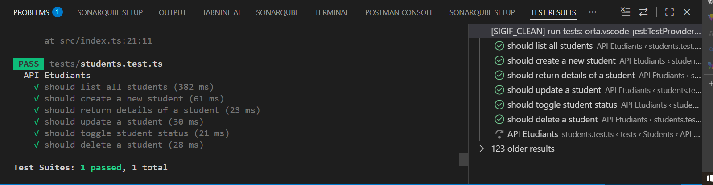

# Student-Api-SIGIF

### Etudiants

| Méthode | Endpoint                           | Description                    |
| ------- | ---------------------------------- | ------------------------------ |
| GET     | `/api/etudiants`                   | Liste des étudiants            |
| POST    | `/api/etudiants`                   | Création d’un étudiant         |
| GET     | `/api/etudiants/stats`             | Statistiques des étudiants     |
| POST    | `/api/etudiants/search/advanced`   | Recherche avancée              |
| GET     | `/api/etudiants/:id`               | Détails d’un étudiant          |
| PUT     | `/api/etudiants/:id`               | Mise à jour d’un étudiant      |
| DELETE  | `/api/etudiants/:id`               | Suppression d’un étudiant      |
| POST    | `/api/etudiants/:id/toggle-statut` | Activation / désactivation     |
| GET     | `/api/etudiants/:id/courses`       | Cours suivis par l’étudiant    |
| GET     | `/api/etudiants/:id/notes`         | Notes de l’étudiant            |
| GET     | `/api/etudiants/:id/moyenne`       | Moyenne générale de l’étudiant |

### Salle
| Méthode | Endpoint                         | Description                      |
| ------- | -------------------------------- | -------------------------------- |
| GET     | `/api/salles`                    | Liste paginée avec filtres       |
| POST    | `/api/salles`                    | Création d'une salle             |
| GET     | `/api/salles/:code`              | Détails d'une salle              |
| PUT     | `/api/salles/:code`              | Mise à jour                      |
| DELETE  | `/api/salles/:code`              | Suppression                      |
| GET     | `/api/salles/:code/schedule`     | Emploi du temps                  |
| GET     | `/api/salles/:code/availability` | Vérification de la disponibilité |
| POST    | `/api/salles/search`             | Recherche avancée                |

### les Filières

| Méthode | Endpoint                            | Description                |
| ------- | ----------------------------------- | -------------------------- |
| GET     | `/api/filieres`                     | Liste paginée avec filtres |
| POST    | `/api/filieres`                     | Création d'une filière     |
| GET     | `/api/filieres/:code`               | Détails avec statistiques  |
| PUT     | `/api/filieres/:code`               | Mise à jour                |
| DELETE  | `/api/filieres/:code`               | Suppression                |
| GET     | `/api/filieres/:code/ues`           | UEs de la filière          |
| GET     | `/api/filieres/:code/students`      | Étudiants de la filière    |
| GET     | `/api/filieres/:code/stats`         | Statistiques               |
| PATCH   | `/api/filieres/:code/toggle-statut` | Activation / désactivation |
| POST    | `/api/filieres/search`              | Recherche avancée          |
| GET     | `/api/filieres/stats/general`       | Statistiques générales     |

### Matieres

| Méthode | Endpoint                        | Description                          |
| ------- | ------------------------------- | ------------------------------------ |
| GET     | `/api/matieres`                 | Liste des matières                   |
| POST    | `/api/matieres`                 | Création d’une matière               |
| GET     | `/api/matieres/:code`           | Détails d’une matière (simple)       |
| PUT     | `/api/matieres/:id`             | Mise à jour d’une matière            |
| DELETE  | `/api/matieres/:id`             | Suppression d’une matière            |
| GET     | `/api/matieres/:id/teachers`    | Enseignants associés à la matière    |
| GET     | `/api/matieres/:id/courses`     | Cours associés à la matière          |
| GET     | `/api/matieres/:id/notes-stats` | Statistiques des notes de la matière |

### Groupe de cours

| Méthode | Endpoint                          | Description                   |
| ------- | --------------------------------- | ----------------------------- |
| GET     | `/api/groupes-cours`              | Liste des groupes de cours    |
| POST    | `/api/groupes-cours`              | Création d’un groupe de cours |
| GET     | `/api/groupes-cours/:code`        | Détails d’un groupe de cours  |
| PUT     | `/api/groupes-cours/:code`        | Mise à jour du groupe         |
| DELETE  | `/api/groupes-cours/:code`        | Suppression du groupe         |
| GET     | `/api/groupes-cours/:id/students` | Étudiants inscrits au groupe  |

## Résultat des test

### Etudiants:
